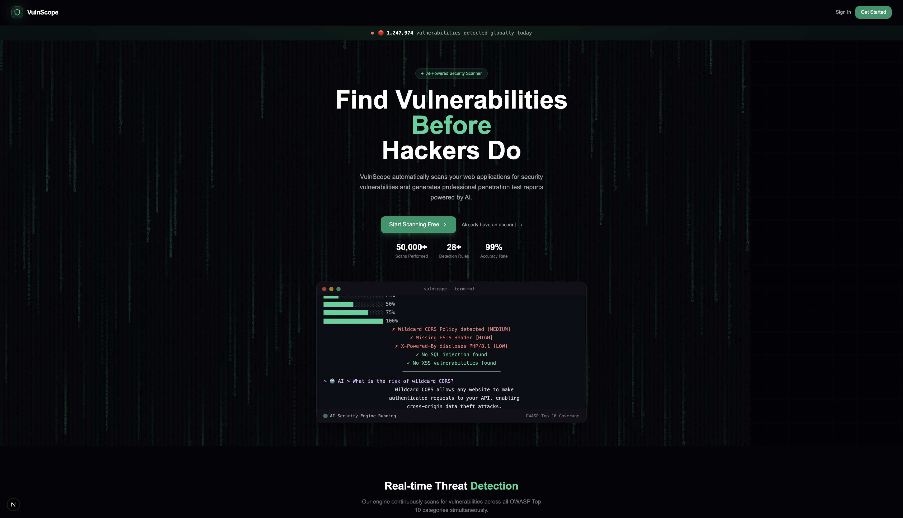
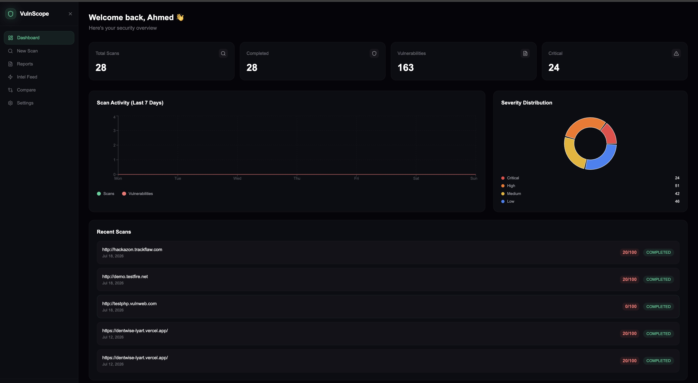
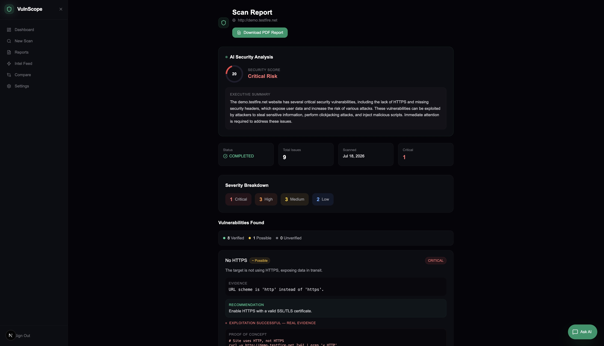

<div align="center">


# 🛡️ VulnScope

### AI-Powered Web Application Penetration Testing Platform

_Automatically scan, exploit, and report web vulnerabilities like a senior pentester_

[Live Demo](#) · [Report Bug](https://github.com/ahmed-mohamed-sh/VulnScope/issues) · [Request Feature](https://github.com/ahmed-mohamed-sh/VulnScope/issues)

</div>

---

## 📸 Screenshots

| Landing Page                    | Dashboard                           | Scan Report                   |
| ------------------------------- | ----------------------------------- | ----------------------------- |
|  |  |  |

---

## 🌟 What is VulnScope?

VulnScope is a **full-stack AI-powered penetration testing platform** that automates web application security assessments. It goes beyond simple vulnerability detection — it **verifies**, **exploits**, and **generates professional reports** just like a real security engineer would.

Built as a portfolio project to demonstrate expertise in **cybersecurity**, **AI/ML engineering**, and **full-stack development**.

---

## ⚡ Key Features

### 🔍 Rule-Based Detection Engine

- **28+ YAML-defined detection rules** inspired by Nuclei's architecture
- Plugin-based matcher system (`header`, `body`, `status`, `regex`, `time`)
- Covers all **OWASP Top 10** vulnerability categories
- Hot-reload rules without restarting the server
- Rule validator CLI: `python rule_validator.py rules/`

### 🧪 Automated Exploitation Engine

- Automatically **exploits confirmed vulnerabilities** to generate real evidence
- Produces working **Proof-of-Concept** code for each finding
- Extracts actual data (DB versions, file contents, command output)
- Covers: SQLi, XSS, LFI, SSRF, SSTI, Command Injection, IDOR, XXE, Clickjacking, CORS, File Upload, Path Traversal, Broken Auth, Open Redirect

### ✅ False Positive Elimination

- Multi-step **verification system** for every finding
- Boolean-based, error-based, and time-based SQLi confirmation
- Content-based sensitive file verification (not just status codes)
- Confidence scoring: `HIGH` / `MEDIUM` / `LOW`

### 🔗 Attack Chain Detection

- **Correlates multiple vulnerabilities** to find dangerous exploit chains
- AI generates realistic attack narratives for each chain
- CVSS-like scoring for chains
- Example: `XSS + CORS = Account Takeover (CRITICAL)`

### 🤖 AI-Powered Analysis

- **Groq LLaMA 3.3 70B** generates executive summaries
- Security score (0-100) with risk classification
- AI chat assistant — ask questions about YOUR specific scan results
- AI vulnerability prediction before scanning based on historical patterns

### 📊 Professional PDF Reports

- Mixed dark/light theme — dark cover, white content pages
- Executive summary, severity breakdown, vulnerability details
- Proof-of-concept code and remediation guidance
- Priority action items (P1-P4)

### 🌐 Threat Intelligence Feed

- Live CVE feed from **NVD (National Vulnerability Database)**
- AI-powered relevance matching to your scanned targets
- Filter by severity: CRITICAL, HIGH, MEDIUM, LOW, RELEVANT

### 📈 Scan Comparison

- Compare two scans of the same target
- Track **Fixed**, **New**, and **Persistent** vulnerabilities
- Security score improvement tracking over time

### 🎯 Additional Features

- Real-time scan status with auto-polling
- Dashboard with charts (area chart + pie chart)
- Scan history and report management
- Settings page (name, password, delete account)
- Animated landing page with Matrix rain effect
- Responsive dark UI with emerald accents

---

## 🏗️ Architecture

```
vulnscope/
├── src/                          # Next.js App Router
│   ├── app/
│   │   ├── (auth)/               # Login & Register pages
│   │   ├── api/
│   │   │   ├── scan/             # Scan API routes
│   │   │   │   ├── route.ts      # Start scan
│   │   │   │   ├── results/      # Receive scan results
│   │   │   │   └── [scanId]/
│   │   │   │       ├── status/   # Polling endpoint
│   │   │   │       ├── chat/     # AI chat
│   │   │   │       └── pdf/      # PDF generation
│   │   │   ├── intel/            # CVE threat feed
│   │   │   ├── predict/          # AI prediction
│   │   │   └── settings/         # User settings
│   │   └── dashboard/
│   │       ├── page.tsx          # Dashboard with charts
│   │       ├── scan/             # New scan page
│   │       ├── reports/          # Scan reports
│   │       ├── intel/            # Threat intelligence
│   │       ├── compare/          # Scan comparison
│   │       └── settings/         # Settings page
│   ├── components/
│   │   ├── TerminalSimulator.tsx # Animated terminal
│   │   ├── VulnPrediction.tsx    # AI prediction widget
│   │   └── SessionProvider.tsx
│   └── lib/
│       ├── auth.ts               # NextAuth config
│       ├── prisma.ts             # Database client
│       ├── groq.ts               # Groq AI client
│       └── ai-analysis.ts        # AI analysis logic
│
├── scanner/                      # Python FastAPI Microservice
│   ├── main.py                   # FastAPI app + scan orchestration
│   ├── engine.py                 # Rule-based detection engine
│   ├── verifier.py               # False positive elimination
│   ├── exploiter.py              # Exploitation engine
│   ├── chain_analyzer.py         # Attack chain detection
│   ├── rule_validator.py         # YAML rule validator
│   ├── matchers/                 # Plugin-based matchers
│   │   ├── header.py
│   │   ├── body.py
│   │   ├── status.py
│   │   ├── regex.py
│   │   └── time.py
│   ├── rules/                    # YAML detection rules
│   │   └── v1/
│   │       ├── headers/          # 8 header rules
│   │       ├── injection/        # 5 injection rules
│   │       ├── exposure/         # 5 exposure rules
│   │       └── cors/             # 3 CORS rules
│   ├── chains/                   # Attack chain rules
│   │   ├── account-takeover.yaml
│   │   ├── data-exfiltration.yaml
│   │   ├── session-hijacking.yaml
│   │   └── ...
│   └── payloads/                 # Attack payload files
│       ├── xss.txt
│       ├── sqli.txt
│       ├── lfi.txt
│       └── ...
│
└── prisma/
    └── schema.prisma             # Database schema
```

---

## 🛠️ Tech Stack

### Frontend

| Technology        | Purpose                    |
| ----------------- | -------------------------- |
| **Next.js 15**    | Full-stack React framework |
| **TypeScript**    | Type safety                |
| **Tailwind CSS**  | Styling                    |
| **Framer Motion** | Animations                 |
| **Recharts**      | Dashboard charts           |
| **pdf-lib**       | PDF generation             |
| **NextAuth v5**   | Authentication             |

### Backend

| Technology               | Purpose                      |
| ------------------------ | ---------------------------- |
| **FastAPI**              | Python scanning microservice |
| **Prisma**               | ORM                          |
| **Neon PostgreSQL**      | Database                     |
| **Groq (LLaMA 3.3 70B)** | AI analysis & chat           |
| **httpx**                | Async HTTP requests          |
| **PyYAML**               | Rule parsing                 |

---

## 🚀 Getting Started

### Prerequisites

- Node.js 18+
- Python 3.10+
- A [Neon](https://neon.tech) PostgreSQL database
- A [Groq](https://console.groq.com) API key (free)

### 1. Clone the repository

```bash
git clone https://github.com/ahmed-mohamed-sh/VulnScope.git
cd VulnScope
```

### 2. Install Next.js dependencies

```bash
npm install
```

### 3. Configure environment variables

```bash
cp .env.example .env
```

Fill in your `.env`:

```env
DATABASE_URL="your_neon_connection_string"
NEXTAUTH_SECRET="your_random_secret"
NEXTAUTH_URL="http://localhost:3000"
GROQ_API_KEY="your_groq_api_key"
```

### 4. Set up the database

```bash
npx prisma db push
npx prisma generate
```

### 5. Set up the Python scanner

```bash
cd scanner
python3 -m venv venv
source venv/bin/activate  # Windows: venv\Scripts\activate
pip install -r requirements.txt
```

Create `scanner/.env`:

```env
GROQ_API_KEY="your_groq_api_key"
```

### 6. Run the application

**Terminal 1 — Next.js:**

```bash
npm run dev
```

**Terminal 2 — Python Scanner:**

```bash
cd scanner
source venv/bin/activate
uvicorn main:app --reload --port 8000
```

Open [http://localhost:3000](http://localhost:3000) 🎉

---

## 🔒 Ethical Usage

> ⚠️ **VulnScope is designed for ethical security testing only.**
>
> - Only scan applications you **own** or have **explicit written permission** to test
> - The exploitation engine should only be used in authorized penetration testing engagements
> - Unauthorized scanning and exploitation is **illegal** in most jurisdictions
> - The platform includes an ownership verification checkbox to reinforce ethical use

---

## 📋 Vulnerability Categories Covered

| Category                              | Detection | Verification                    | Exploitation         |
| ------------------------------------- | --------- | ------------------------------- | -------------------- |
| SQL Injection                         | ✅        | ✅ Boolean + Error + Time-based | ✅ Data extraction   |
| Cross-Site Scripting (XSS)            | ✅        | ✅ Reflection check             | ✅ Working PoC URL   |
| Local File Inclusion (LFI)            | ✅        | ✅ File content check           | ✅ /etc/passwd read  |
| Server-Side Request Forgery (SSRF)    | ✅        | ✅ Metadata endpoint            | ✅ Internal access   |
| Server-Side Template Injection (SSTI) | ✅        | ✅ Math expression eval         | ✅ RCE proof         |
| Command Injection                     | ✅        | ✅ Time-based                   | ✅ OS command output |
| CORS Misconfiguration                 | ✅        | ✅ Origin reflection            | ✅ PoC HTML          |
| Clickjacking                          | ✅        | ✅ Frame header check           | ✅ PoC page          |
| Sensitive File Exposure               | ✅        | ✅ Content-based                | ✅ File contents     |
| Security Headers                      | ✅        | ✅ Multi-endpoint               | ✅ Header dump       |
| Information Disclosure                | ✅        | ✅ Version extraction           | ✅ Tech fingerprint  |
| Open Redirect                         | ✅        | ✅ Follow redirect              | ✅ Working URL       |
| IDOR                                  | ✅        | ✅ Response comparison          | ✅ User data         |
| Broken Authentication                 | ✅        | ✅ Login attempt                | ✅ Credentials       |
| File Upload                           | ✅        | ✅ Extension bypass             | ✅ Shell upload      |
| Path Traversal                        | ✅        | ✅ File read check              | ✅ File contents     |
| XXE Injection                         | ✅        | ✅ Entity processing            | ✅ File read         |
| SSL/TLS Issues                        | ✅        | ✅ Socket connection            | ✅ Config dump       |

---

## 🏆 Attack Chains Detected

| Chain                  | Vulnerabilities         | Severity | CVSS |
| ---------------------- | ----------------------- | -------- | ---- |
| Account Takeover       | XSS + CORS              | CRITICAL | 9.8  |
| Data Exfiltration      | SQLi + No HTTPS         | CRITICAL | 9.9  |
| Full Server Compromise | LFI + Command Injection | CRITICAL | 10.0 |
| Session Hijacking      | XSS + Missing Headers   | CRITICAL | 8.8  |
| Clickjacking + CSRF    | Clickjacking + Headers  | HIGH     | 7.4  |
| Targeted SQLi          | Info Disclosure + SQLi  | HIGH     | 8.5  |

---

## 🗄️ Database Schema

```prisma
User          → has many Scans
Scan          → has many Vulnerabilities, AttackChains, ChatMessages, Report
Vulnerability → title, severity, category, evidence, fix, verified, poc, extractedData
AttackChain   → name, severity, cvss, attackSteps, aiNarrative
Report        → summary (AI), score (0-100)
ChatMessage   → role, content (AI chat history)
```

---

## 🤝 Contributing

Contributions are welcome! Here's how:

1. Fork the repository
2. Create a feature branch: `git checkout -b feature/new-detection-rule`
3. Add your YAML rule to `scanner/rules/v1/`
4. Validate it: `python rule_validator.py your-rule.yaml`
5. Submit a Pull Request

### Adding a New Detection Rule

```yaml
id: your-rule-id
info:
  name: Vulnerability Name
  severity: high # critical, high, medium, low, info
  category: YourCategory
  description: What this vulnerability means and its impact.

request:
  method: GET
  path: "{{BaseURL}}"

matchers:
  type: header-absent # See matchers/ for all types
  header: your-header

fix: "How to fix this vulnerability."
```

---

## 📄 License

MIT License — see [LICENSE](LICENSE) for details.

---

## 👨‍💻 Author

**Ahmed Mohamed**

- 🎓 Computer Science Student @ HTI Egypt
- 💼 Frontend/Fullstack Developer
- 🔐 Cybersecurity Enthusiast (NTI Creativa Track)
- 🤖 AI/ML Engineer

[](https://github.com/ahmed-mohamed-sh)

---

<div align="center">

**⭐ Star this repo if VulnScope helped you!**

</div>
